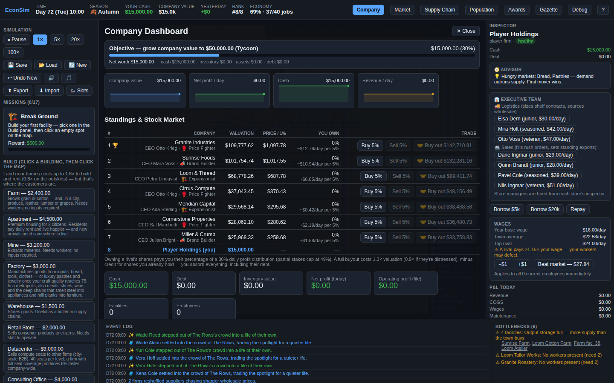
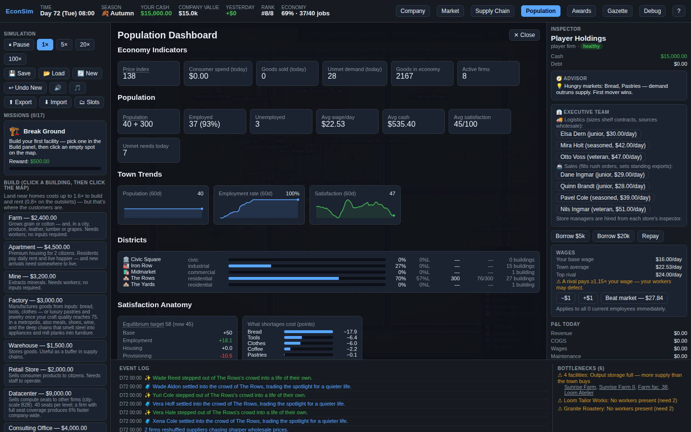
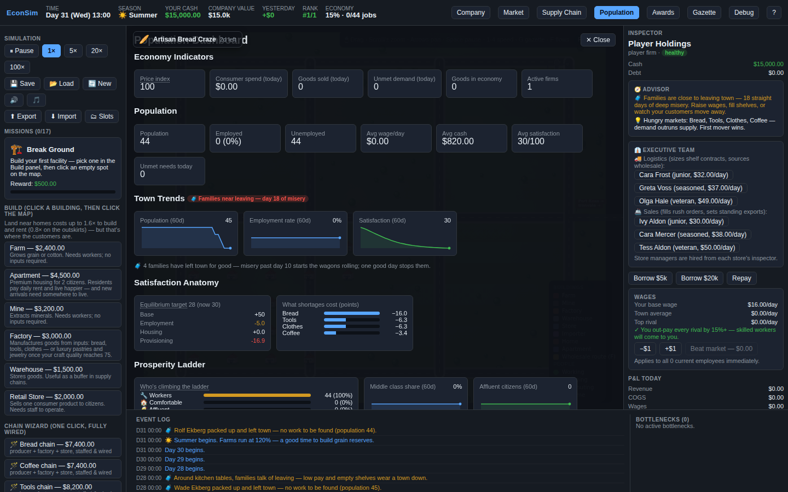

# EconSim — a Capitalism Lab in miniature

A deterministic, inspectable, browser-based economic simulation. A small town of
citizens earns wages, shops, and consumes; firms run real supply chains (farm →
bakery → store; mine → tool works → store; cotton farm → tailor → boutique);
prices move with supply and demand;
firms make or lose money; an AI competitor reacts; and **you** run a company —
building facilities, setting prices and wages, hiring workers, and wiring up
supply contracts.

It is intentionally small in scope but **not shallow**: goods physically move
through inventories, money is conserved to the cent, the same seed always
replays identically, and every important number can explain itself in the UI.

The town is drawn with a procedural 2.5D building kit — cottages, barns,
sawtooth factories, awninged shops — on a daylight map that repaints with the
seasons (snowfields in winter) and falls into a real night, streetlamps and
lit windows glowing, on a proper day/night curve.


<p align="center">
  
  
</p>

---

## Quick start

```bash
npm install
npm run dev        # open the printed http://localhost:5173 URL
```

Other commands:

```bash
npm test           # run the Vitest suite (engine correctness + 365-day stability)
npm run build      # type-check (tsc) + production build (vite)
npm run typecheck  # type-check only
```

### How to play (60-second tour)

1. Press **Play** (top-left) and pick a speed (1× / 5× / 20× / 100×).
2. Watch the map: green dots are citizens working, orange dots are shopping,
   purple squares are shipments moving goods between facilities.
3. Click any facility, citizen, firm, or shipment to inspect it in the right
   panel. Hover any underlined number for the formula behind it.
4. Open the dashboards (top bar): **Company**, **Market**, **Supply Chain**,
   **Population**, **Debug**.
5. Build a competing bread chain: in the left **Build** panel pick **Farm**,
   click an empty spot on the map; do the same for a **Factory** and a **Retail
   Store**. Then, in each facility's inspector:
   - Farm → select recipe **Grow Grain**, **Hire** workers.
   - Factory → select recipe **Bake Bread**, hire workers, create a supply
     contract pulling **grain** from your farm.
   - Retail Store → set retail product to **Bread**, set a price, hire a clerk,
     create a contract pulling **bread** from your factory.
6. Undercut the AI's bread price and watch your market share grow (or your cash
   bleed if you price below cost). Save anytime; it persists in `localStorage`.

---

## Architecture

The golden rule: **the simulation engine is completely independent of React.**
React only renders state and dispatches commands.

```
UI (React)  ──dispatch(Command)──▶  Simulation  ──mutates──▶  GameState
   ▲                                    │
   └──────────reads (selectors)─────────┘
```

```
/src
  /sim
    /core         Simulation, GameState, SimulationConfig, Random (seeded PRNG),
                  Id, Tick, Commands, Events, Transactions
    /entities     Citizen, Firm, Facility, Product, Recipe, Inventory, Vehicle,
                  Contract, Market, Accounting, Location, factories
    /systems      One file per system; run in a fixed order each tick
    /data         products, recipes, facilityDefinitions, startingScenario,
                  names, constants  (all game rules live here, as data)
    /selectors    Pure read-only views for the UI (company, market, citizen,
                  facility, supplyChain, debug)
    /persistence  saveLoad (JSON <-> localStorage), migrations
    /tests        Vitest specs (see "Tests")
  /store          useGameStore — the thin Zustand bridge + fixed-step driver loop
  /ui             React components (display + intent only)
  /render         TownRenderer — self-contained animated canvas (zoned town,
                  roads, buildings, citizens, trucks, day/night, $/goods popups)
  /utils          formatMoney, formatTime, math, clamp
```

### The simulation loop

`Simulation.tick()` advances the clock by exactly one tick and runs every system
in a **fixed order**. Daily roll-up systems run first (so the day that just
ended is finalized before the new day's per-tick systems run):

```
TimeSystem → WorldEvents → TradeCity → MarketStats → AIStrategy → EventLog →
Marketing → Finance → Dividends → Bankruptcy → Satisfaction → TownStats →
Immigration → Rent → Accounting → Payroll →                 (daily roll-ups)
CitizenSchedule → Movement → Labor → Production → Logistics → Retail →
Achievements → Missions                                     (every tick / hourly)
```

Each system is a function `(ctx: SimContext) => void` that mutates the live
`GameState` in place (chosen for speed: 365 in-game days simulate in ~1.5 s).
Systems that only act daily/hourly guard on `isDayBoundary` / `isHourBoundary`.

Time model: `ticksPerHour` (default 2) → a day is 48 ticks. Work hours 08–16;
shops open 08–22; citizens shop after work (or sooner if a need is urgent).

### Determinism

- All randomness comes from a single seeded PRNG (`core/Random.ts`,
  mulberry32-style). Its entire state is one `uint32` stored **inside**
  `GameState` (`rngState`), so it can never desync and round-trips through
  save/load. `Math.random()` is never used in the engine.
- Ids are generated from per-prefix counters in `GameState`, not timestamps.
- Result: the same seed + same command sequence ⇒ byte-identical state
  (verified by `determinism.test.ts` and `saveLoad.test.ts`).

### Money & accounting

- All money is **integer cents**. Every cash movement goes through one helper,
  `recordTransaction`, which moves the money, appends a transaction record, and
  updates the affected firm's accounting accumulators. So a firm's books always
  reconcile with the transaction log (`accounting.test.ts`).
- Accounts are firms, citizens, or a single **world** account (utilities /
  government / outside world). Maintenance, variable production costs, logistics,
  build spend, and subsistence flow to/from the world account, so **total money
  across citizens + firms + world is conserved exactly** (asserted in tests).

---

## Entity model (summary)

| Entity   | Owns / has | Key behaviour |
|----------|------------|---------------|
| Citizen  | home, optional job, cash, needs, satisfaction | wakes, commutes, works, earns wages, shops by store score, consumes |
| Firm     | cash, facilities, employees, prices, wage policy, accounting, AI strategy | produces, prices, pays wages, profits or goes distressed/insolvent |
| Facility | type, owner, inventories, recipe/retail product, employees, status | produces / sells / stores; reports bottlenecks |
| Product  | base price, category, perishability, scoring weights, need type | data-driven catalog |
| Recipe   | inputs, outputs, labor, ticks, variable cost | data-driven transformation |
| Contract | source, destination, product, reorder point, target, max | drives logistics shipments |
| Vehicle  | cargo, route, ETA, transport cost | moves goods between facilities |
| Market   | per-product demand/supply/price/share stats | drives dashboards + AI |

---

## Economic formulas (all in code, all inspectable in the UI)

**Production** (`ProductionSystem.ts`)
```
workerFactor      = laborRequired > 0 ? min(2.5, presentWorkers / laborRequired) × avgCrewSkill : 1
inputAvailability = all inputs present ? 1 : 0
efficiency        = baseEfficiency * workerFactor * inputAvailability
productionProgress += efficiency        (per tick)
when progress ≥ ticksRequired: consume inputs, add outputs, pay variableCost
status = input-starved | labor-starved | inventory-full | active
```

**Store score** (`RetailDemandSystem.ts`) — how a citizen picks a store
```
availability = inStock ? 1 : 0
price        = clamp(referencePrice / actualPrice, 0, 2) / 2
distance     = 1 - clamp(dist / maxShoppingDistance, 0, 1)
quality      = stockQuality / 100
brand        = firmBrand / 100
reliability  = prior successful purchases (capped)
novelty      = builtAtTick > 0 && age < 15d ? 0.12 × (1 − age/15d) : 0
score = 0.28*availability + 0.22*price + 0.18*distance
      + 0.14*quality + 0.12*brand + 0.06*reliability + novelty  (+ seeded jitter)
```
A purchase happens only if the store is open & stocked, the citizen can afford
it, the need is above threshold, and the price is within their willingness to pay.

**Multi-product stores & baskets**: a store carries up to 3 products
(`TOGGLE_RETAIL_PRODUCT`). On arrival a shopper buys every carried product they
need, most urgent first — one staffed storefront, several revenue streams. The
grand-opening novelty term plus penetration pricing (the auto-pricer dives
toward 0.78× base while share < 12%) make cold-start retail winnable; at high
share the same controller drifts prices toward a market-power premium (up to
~1.45× base), so winning a market genuinely pays. Staffing beyond a recipe's
labor requirement scales output (up to 2.5×) — hiring is a growth lever, and
full employment unlocks immigration.

**Chain wizard** (`BUILD_CHAIN`): one click stands up a wired, staffed
producer → factory → store near the town's homes — with auto-pricing on and a
starter ad budget, because entering a market where the incumbent has brand and
loyal customers takes penetration pricing *and* advertising (the AI's own
playbook). Both defaults are single toggles in the store inspector.

**Accounting** (`AccountingSystem.ts`, `entities/Accounting.ts`)
```
grossProfit     = revenue − costOfGoodsSold
operatingProfit = revenue − COGS − wages − maintenance − logistics − variableProductionCost
```
COGS = materials bought from the importer. Internal transfers cost nothing;
internal production cost shows up as wages + variable cost (no double counting).

**AI pricing** (`AIStrategySystem.ts`) — a mean-reverting controller
```
sold out while selling        → raise 2–5%
has stock but sold nothing    → cut hard (priced out of market)
walkaways outnumber buyers    → cut hard (affordability thermostat)
held surplus, no sellout      → cut gently
selling steadily              → drift toward base price
clamped to [floor, ceil] × basePrice
```
The affordability thermostat counts shoppers who saw the price and walked away
(`dailyStats.pricedOut`); without it, quality/brand premiums let prices ride
the market-power ceiling past what citizens can pay and demand quietly dies.

**AI personalities** (`data/personalities.ts`): every rival firm has a named
CEO with an archetype — 🥊 Price Fighter, 📣 Brand Builder, 🏗️ Expansionist,
🚢 Exporter — that tilts the same shared knobs (ad cap, cut depth, penetration
target, expansion appetite, R&D cadence, export eagerness). Scenarios pin
personalities for flavor; the CEO and stance show in the Company dashboard
standings and the firm inspector. The cast isn't fixed: leave a staple
unsold for weeks in a thriving town and a brand-new rival founds a chain
for it (`AIFounderSystem.ts`) — capital follows people, so serving your
markets is also how you keep competitors out.

**Strategic depth — the three Capitalism-Lab axes** (you win on more than price):

- **Brand / Advertising** (`MarketingSystem.ts`): a daily ad budget builds brand
  (diminishing returns, ~3%/day decay). Brand adds a 12% term to the store score
  *and* raises willingness-to-pay (`price cap × (1 + brand/250 + (quality−50)/300)`).
- **Quality / R&D** (`INVEST_RND` command): cash buys quality points (diminishing
  toward 100); production stamps the firm's quality onto its goods, feeding the
  quality term in demand + willingness-to-pay.
- **Finance / Loans** (`FinanceSystem.ts`, `TAKE_LOAN`/`REPAY_LOAN`): borrow up to
  1.5× net worth; daily interest is a real cost; `net profit = operating − interest`.
  Heavy debt deepens insolvency — leverage is genuine risk/reward.

The AI uses all three (advertises, invests in quality when flush, borrows to
**open new outlets** where demand is unmet), so the world grows on its own.

**Land value** (`core/LandValue.ts`): ground near homes (foot traffic) costs
0.8×–1.6× to build on and rent, shown as a green→red heatmap while placing.
Downtown premiums buy real customers via the distance term in store scoring.

**Labor market** (`LaborSystem.ts`): workers carry a skill multiplier
(~0.85→1.3 with tenure; crews produce at average skill) and jump to firms
paying ≥15% more — wage policy poaches veterans or loses yours. The Wages
card in your firm inspector shows the town average and top rival wage with a
one-click "Beat market"; AI firms answer back, raising wages up to ~1.5× when
they can't fill slots and drifting down when labor is slack. Or skip the
wage war: **train your crew** from the facility inspector — $120/worker
buys +0.15 skill on the spot (~2 weeks of practice, booked as R&D).

**Real estate** (`RentSystem.ts`): buildable Apartments house 2 citizens who
pay daily rent to the owner and live measurably happier; municipal homes stay
free. With immigration filling vacancies, housing is a fourth business
vertical — build near the action (land premium) and let the town grow into
your units.

**Satisfaction & growth** (`SatisfactionSystem.ts`, `selectors/satisfactionSelectors.ts`)
```
equilibrium = 50 + (employed ? +20 : −5) + (apartment ? +5 : 0)
            + clamp(15 − unmetPressure × 12, −30, +15)
pressure    = Σ over urgent needs: (urgency − threshold) × needWeight × (sold nowhere ? 0.5 : 1)
```
Citizens drift 12%/day toward their equilibrium; town-average ≥55 (plus tight
labor) opens immigration. The Population tab decomposes this live and prices
each product's shortage in equilibrium points — stagnation always names its
cause.

**Prosperity ladder** (`TierSystem.ts`, design in
`docs/design/classes-and-ascension.md`): every citizen sits on a
🔧 worker → 🏠 comfortable → 🥂 affluent ladder, derived daily with
hysteresis (days of steady income + satisfaction to climb, sustained
floor-failure to slip). Tiers change demand **additively** — affluent
citizens drink 1.5× the coffee, tolerate premium prices, and unlock luxury
cravings; workers keep the calibrated baseline (probes showed any
per-capita cut contracts the whole town). Stores answer with
**positioning**: a 🏷️ Discount sign (earned by pricing ≤95% of market)
courts workers; a ✨ Premium sign (earned by shelf quality ≥60) courts the
affluent and supports 15% higher prices — unearned signs do nothing. AI
CEOs adopt formats in character. The Population tab charts the ladder;
gold circlets mark affluent citizens on the map.

**AI supply elasticity** (`AIStrategySystem.ts`): shortage signals (finished-
product unmet > sold, routed upstream through contracts) climb a ladder —
over-crew (to 2.5× output) → level upgrades → widen shelf contracts → double
the whole production sub-chain (producer + factory II) — and reverse under
losses (boost brake + downsizing), so booms end in equilibrium instead of
insolvency. Some towns still stagnate in a poverty trap the AI cannot escape:
that gap is deliberately the player's opening.

**M&A** (`core/Acquisition.ts`, `core/FireSale.ts`): buy out AI rivals at
1.3× valuation (0.9× distressed, credit for held shares) and absorb
everything; flush AI firms rescue-acquire dying rivals too. Smaller deals
roll in as **fire sales**: a rival facility bleeding money on the 7-day
view goes on the block at 75% of build cost for four days — accept from
the ticker and the building, its crew, and its supply lines transfer to
you. Objectives escalate on a ladder (Tycoon $50k → Magnate $100k →
Business Empire $200k, re-priced from 600-day pacing probes).

**Inter-city trade** (`TradeCitySystem.ts`, `core/Trade.ts`,
`data/tradeCities.ts`): two distant markets price every product on bounded
daily random walks (0.6×–1.8× of each city's center). 🚢 **Port Rosa** is the
balanced port; 🚂 **Ironvale**, an industrial inland hub, pays up for tools,
minerals and finery but discounts food — and its higher freight (×1.15) eats
into the premium. The two walks are anti-correlated, so arbitrage spreads
open and close. Stage goods in a warehouse and EXPORT at the best city's
price minus ~8% freight — manually, or with **standing orders** ("auto-export
≥1.3×, keep 10") that route to the better port daily after the price walk. AI
firms broker their surpluses at a steeper 15% fee, also to the best payer.
Booms/gluts make the news; the Market dashboard charts the best export quote.
The **commodity desk** (warehouse inspector) makes the walks playable in both
directions: buy from either city at price + freight, hold the position in
storage, and export the spike — temporal arbitrage on top of spatial
(design + viability probe in `docs/design/commodity-market.md`).
Once you own a warehouse, **rush orders** roll in occasionally (`RushOrderSystem.ts`):
a port's buyer wants a bulk load (40–120 units) delivered within six days for
a bonus of ~35% of the order's value on top of normal export revenue — any
port counts, the ticker tracks progress, and letting one lapse makes the news.

**Wholesale market**: supply contracts can source from *other firms'*
facilities — the buyer pays the seller's asking price on each shipment
(50–100% of market average, default 70%; the seller books it as revenue).
AI buyers shop around: they pick the cheapest qualifying supplier and drop
anyone priced above import parity. Sellers never part with stock
their own chains reserve, and broke buyers don't get shipped to. Buying
local intermediates beats the importer's 1.5× markup; a pure storefront fed
entirely by wholesale roughly breaks even until you add advertising, sharper
prices, or scale — a low-capital entry ramp, not free money.

**Luxury tier**: pastries (grain) and jewelry (minerals) satisfy a 'luxury'
need that only grows for satisfied, well-off citizens. Their recipes demand
craft quality ≥75 (invest R&D first). No AI sells luxury at the start — but a
genuinely flush AI enters after day 60 with an atelier and boutique.

**Civic actions**: sponsor a 3-day town festival (+demand for every seller) or
fund a new home (two citizens move in immediately) — spend on the town itself.

**Seasons & scenarios**: four 30-day seasons cycle farm output, winter demand,
and freight; seven starting scenarios (Meadowbrook, Gold Rush Gulch, Port
Haven, Harvest Valley, Mill Country, Boomtown Flats, Dust Hollow) change
which AI chains exist and which CEOs run them — each variant leaves a market
gap that's the player's opening, and each has its own social character
(shown on the scenario card): Gold Rush mints affluence on its own, Mill
Country stays a worker town until someone lifts it (earning the Lifted the
Town achievement), and Dust Hollow opens with the company gone and families
already packing — stop the emigration and you've Stopped the Bleed.

 Mill Country's mills all import their raw goods: build the
farms and mines they lack and every factory in town becomes your wholesale
customer. Boomtown Flats starts with every home full — immigration waits on
whoever builds the housing, and rival landlords want the same ground. Facility upgrades (L1→L3) raise storage, speed, and crew
size; the endgame Chronicle retells your whole run when you reach Business
Empire.

**Town size**: New Game offers Cozy (40 homes / 80 citizens) or Bustling —
double the caps on a taller map. Growth is earned either way: immigration
only flows while satisfaction and employment stay high, so the ceiling you
reach is the economy you built.

**World scale** (`docs/design/cohorts-and-districts.md`): New Game also picks the
*shape* of the world. **Village** (default) is the classic game, bit-for-bit —
every resident is a named, fully-simulated citizen you can follow. **City** keeps
that cast but grows a crowd of hundreds as statistical **district × tier
cohorts** that earn, shop, and climb the same ladder alongside them, on a bigger
authored map partitioned into **districts** (shown in the Population tab). A City
game opens the specialist economy: a **B2B services** channel (firms sell
datacenter **compute** and consulting to each other) and the three firm
**archetypes**
(`docs/design/firm-archetypes.md`) wake up: **landlords** that develop and rent
housing — and lease commercial premises to you, so you can pick a landlord in the
Build panel and pay daily rent instead of the build cost upfront
(`real-estate.md`); **holdcos** that work an equity book against rivals' public
float (`stock-market.md`); and **service firms** running the compute/consulting
providers (`b2b-services.md`). A third, larger **Metropolis** (beta) is now a New
Game option too: a 390×276 map whose founder fills toward **25-30 firms** across
the **full 18-product catalog** — the consumer chains grow from 8 to 18 there
(prepared food, shoes, furniture, appliances, wine, plus the steel and planks
**deep chains** the wizard builds raw→intermediate→consumer). It wires the same
crowd/services/landlord/trade channels a City does (a live holdco is the one
exception — its founder row is city-only), and the player opens with a cash
uplift ($28k at standard, AI-founder parity) for the bigger board and pricier
chains. City and Metropolis are beta; Village stays the reference world the
determinism and conservation guarantees are pinned against.


**Challenge mode**: tick the 🏁 box on New Game and the run ends with a final
0–1000 score at day 200 (valuation-weighted, plus town satisfaction, peak
share, and export revenue). Satisfaction only scores above 55 — an unattended
town equilibrates around 60–65, so the points start where stewardship starts
(90 maxes it). Scores land on a local leaderboard in Awards — and since the
engine is deterministic, a seed + scenario + difficulty is a shareable
challenge.

**World events** (`WorldEventSystem.ts`, defs in `data/worldEvents.ts`): once per
day there is a 20% chance a news event starts (max 2 active, opposites never
overlap). Events are temporary town-wide modifiers with a headline — economic
booms/recessions move willingness-to-pay ×1.25/×0.75, droughts/bumper harvests
scale farm output ×0.5/×1.6, mine collapses/rich veins scale mines, product
crazes raise per-trip purchase quantity ×1.6, fuel spikes scale transport cost
×2.2, and tariffs raise import prices ×1.5. Active events appear as chips on
the map (hover for the playbook) and in the event log; they roll from the
seeded rng, so a given seed always produces the same news history.

---

## Extending the simulation

Everything that defines the game is **data** in `/src/sim/data`.

**Add a product** — append to `products.ts`. If consumers buy it, give it a
`needType` of `food`/`goods`; add a need for it in `startingScenario.ts`.

**Add a recipe** — append to `recipes.ts` (inputs/outputs/labor/ticks/variable
cost), then list its id in the relevant facility definition's `allowedRecipes`.

**Add a facility type** — add a `FacilityType` in `entities/Facility.ts`, a
definition in `facilityDefinitions.ts`, and (if it produces) recipes. Add it to
`BUILDABLE_DEFS` to let the player build it.

**Add an AI strategy** — extend `FirmStrategy.kind` and branch in
`AIStrategySystem.ts`. The system already has hooks for restaffing and pricing.

**Add a system** — write `(ctx: SimContext) => void` in `/systems` and insert it
into the `SYSTEMS` array in `core/Simulation.ts` at the right point in the order.

**Add a command** — add a case to the `Command` union (`core/Commands.ts`) and a
handler in `Simulation.dispatch`. The UI dispatches it; the engine validates it.

**Tune the economy** — `core/SimulationConfig.ts` (`DEFAULT_CONFIG`) holds tick
rate, work/shop hours, payroll, distress thresholds, AI price bounds, subsistence
income, etc. Config is part of saved state.

---

## Tests

`npm test` runs the Vitest suite (`src/sim/tests`):

- **production** — consumes inputs & makes outputs; halts without inputs;
  slows/stops without workers.
- **retail** — purchase moves cash citizen→firm and reduces inventory; need
  urgency drops; stockouts create unmet demand; lower price scores higher.
- **payroll** — wages move firm→citizen; missed payroll is recorded when broke.
- **pricing** — AI raises on sellouts, cuts on surplus, stays within bounds.
- **logistics** — contracts ship goods source→destination; importer sourcing
  charges the buyer; cross-firm (wholesale) shipments pay the seller's
  asking price (default 70% of market) on dispatch, never raid the seller's
  own reserved stock, and skip buyers who can't pay.
- **accounting** — firm books match the transaction log; **money supply is
  conserved** across the economy.
- **saveLoad** — serialize/deserialize restores identical state; save==keep
  running.
- **determinism** — same seed ⇒ identical state; different seeds differ.
- **stability** — **365 in-game days** run without crashing, with logs bounded
  and money conserved.

---

## Design decisions & defaults (documented tradeoffs)

- **In-place mutation** of a single `GameState` (no Immer) for 100× speed.
- **World account** absorbs external costs so money is perfectly conserved and
  the importer is modeled as a real firm.
- **Retail "open"** = staffed (≥1 assigned employee) within open hours; selling
  is not gated on a clerk being physically present (production *is* gated on
  present workers). This abstraction avoids dead stores during the shopping
  window. See `storeIsOpen`.
- **Subsistence income** (`config.subsistenceIncomePerDay`, default $12/day) is
  paid to unemployed citizens from the world account so the consumer economy
  keeps functioning at high unemployment. Set to 0 for a harsher world.
- **Satisfaction is an equilibrium**, not a counter: it drifts toward a level
  set by employment and whether needs are met (≈85 employed & provided, ≈60 on
  subsistence, far lower under chronic shortage), so the town reads as healthy
  by default and reacts to shocks. A 120-day no-player balance test guards this.
- **Starting scenario**: 40 citizens / 20 homes; three AI firms (bread, tools,
  and clothes chains); an external importer; a player firm with $15,000 and no
  facilities (buildable land). Lean staffing so the AI chains are roughly
  break-even and there's room for the player to compete.

## Known limitations

- One town. The Village AND City consumer catalog is three staple chains
  (bread, tools, clothes), everyday coffee, and the two luxury crafts — the City
  crowd deliberately shops that base catalog to keep its calibration stable. The
  broadened **18-product catalog** and the 25-30-firm founder live only in the
  **Metropolis** preset (a New Game option — see World scale).
- **City and Metropolis are beta**: the crowd, districts, specialist archetypes,
  wider catalog, and deep chains are pinned by probes and soak tests, but only
  Village carries the full bit-identity guarantee.
- AI stores are deliberately single-product (running a general store is a
  player edge); operator AI expansion opens retail outlets only (capped) and
  AI-initiated M&A is limited to rescue takeovers of distressed rivals.

## Roadmap

Multiple cities & inter-city trade · taxes & subsidies · inflation & macro
policy · deeper AI (upstream expansion, AI-initiated M&A) · land values & rent ·
a scenario editor & mod support · LLM-driven strategic agents (the command API
is designed for this).

Already in (the Capitalism-Lab core loops): real supply chains, retail demand &
pricing, **brand/advertising**, **quality/R&D**, **corporate finance/loans**,
a **stock market** (buy up to 49% of rivals; 30% of their daily profit is paid
out as dividends pro-rata), **town growth** (high satisfaction + a tight labor
market attracts immigrants; the municipality builds new homes — creating jobs
literally grows your market), competing AI that expands, financial statements,
company valuation & standings, bankruptcy, save/load with migrations.
